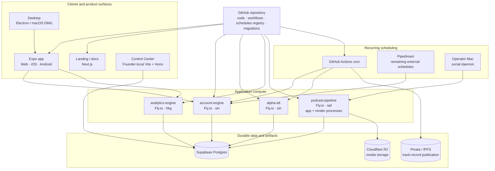

# Current deployed architecture

This document describes the current deployed topology and ownership boundaries. It complements [architecture planes](./planes.md), which defines logical product boundaries rather than infrastructure.

The repository is the source of truth for application code, deployment configuration, scheduled-work inventory, and database migration history. Production data remains in Supabase; production schema changes remain manual operator actions after reviewed migrations are merged.

## Source-of-truth boundaries

| Concern                                    | Source of truth                                          | Notes                                                                                                                            |
| ------------------------------------------ | -------------------------------------------------------- | -------------------------------------------------------------------------------------------------------------------------------- |
| Application and infrastructure definitions | GitHub repository                                        | Code, checked-in deployment config, workflow definitions, and architecture docs live here.                                       |
| Fly deployment inventory                   | [`.github/fly-apps.json`](../../.github/fly-apps.json)   | CI validates the checked-in Fly app registry.                                                                                    |
| Recurring work inventory                   | [`.github/schedules.json`](../../.github/schedules.json) | Includes GitHub Actions, remaining Pipedream jobs, process intervals, the local social daemon, and the Electron scheduler.       |
| Database migration history                 | [`supabase/migrations/`](../../supabase/migrations/)     | New schema changes are added only here. Production apply is manual: review, merge, `db push --dry-run`, then operator `db push`. |
| Database bootstrap roles                   | [`supabase/roles.sql`](../../supabase/roles.sql)         | Used by local `db reset` and fresh-environment bootstrap. Production roles already exist; `db push` does not apply this file.    |
| Production application data                | Supabase Postgres                                        | GitHub records schema intent/history; it does not contain the production data itself.                                            |
| Podcast media                              | Cloudflare R2                                            | Object storage only. There is no Cloudflare Workers compute dependency in the current architecture.                              |
| Signed track-record publication            | Pinata / IPFS                                            | The daily GitHub Actions pipeline publishes the signed snapshot.                                                                 |

## Services and ownership

### account-engine

**Runtime:** Fly.io (`account-engine`, primary region `sin`).

**Owns:** user identity, wallet/account persistence, subscriptions, Telegram-facing account jobs, decision-packet orchestration, and plan orchestration.

**Does not own:** portfolio analytics strategy logic or transaction execution inside the user's wallet. Those boundaries are defined in [architecture planes](./planes.md).

### alpha-etl

**Runtime:** Fly.io (`alpha-etl`, primary region `sin`).

**Owns:** external portfolio/market ingestion and canonical historical portfolio writes.

Historical portfolio semantics are documented in [snapshot architecture](../snapshot_architecture.md). The canonical daily history is stored under the `analytics` schema; do not duplicate its replacement/write mechanics here.

**Does not own:** user-facing analytics decisions or production schema deployment.

### analytics-engine

**Runtime:** Fly.io (`analytics-engine-xws3ra`, primary region `hkg`).

**Owns:** portfolio analytics, strategy calculations, backtesting, risk metrics, and analytical read APIs.

**Does not own:** transaction construction/execution or production database migrations.

### podcast-pipeline

**Runtime:** Fly.io (`from-fed-to-chain-api`, primary region `iad`) with separate `app` and `render` processes.

**Owns:** article-to-episode processing, localization, social publishing data, render queues, and media generation. Metadata lives in Supabase; generated HLS/video/visual artifacts live in Cloudflare R2.

**Does not own:** Zap Pilot portfolio/account state.

### Universal app

**Runtime:** Vercel for web; EAS Build/Submit for iOS and Android.

**Owns:** user-facing portfolio, decision, activity, and execution experiences.

**Does not own:** authoritative server-side planning or analytics computation.

### Landing page

**Runtime:** Vercel.

**Owns:** public marketing and documentation surfaces.

### Desktop

**Runtime:** manually packaged macOS DMG.

**Owns:** the Electron shell around the app web export and desktop-only integration such as the rebalance notification scheduler.

### Control Center

**Runtime:** founder-local Vite UI plus Hono API.

**Owns:** the unified operational read model, customer service/economics views, persisted cost history, and social-performance evidence. The detailed operational contracts live in [`apps/control-center/README.md`](../../apps/control-center/README.md); do not duplicate adapter thresholds or scoring rules here.

**Does not own:** production application request traffic or production daemons.

## Data ownership

The single Supabase project contains multiple logical schemas with different owners:

- `public`: core Zap Pilot account/application data consumed primarily by account-engine and product clients.
- `analytics`: canonical daily portfolio history and derived analytical history, written by alpha-etl and read by analytics consumers. See [snapshot architecture](../snapshot_architecture.md).
- `alpha_raw`: ETL-oriented source/staging data that remains part of the ingestion boundary where present.
- `from_fed_to_chain` and `from_fed_to_chain_private`: podcast, localization, render, and social-pipeline state owned by podcast-pipeline.
- `ops`: private operational state used by Control Center and supporting pipelines, including cost accounting, customer-service overrides, and per-source refresh bookkeeping; it is not exposed directly through the Supabase Data API.

All new schema changes go through the root [`supabase/migrations/`](../../supabase/migrations/) workflow. GitHub records migration history, but applying a migration to production remains an explicit operator step.

## Scheduling model

Recurring work is inventoried in [`.github/schedules.json`](../../.github/schedules.json), not duplicated in this document.

- GitHub Actions owns repository-native cron jobs such as track-record publication, backtest refresh, strategy-change broadcast, Telegram token cleanup, ops cost sync, and alpha-etl daily refresh.
- Pipedream currently remains the external scheduler for `daily-suggestion` and `weekly-report`.
- Long-running or in-process intervals stay with their runtime (Fly process or Electron) and are registered in the same schedule registry.
- `social-daemon` remains an operator-Mac process because it depends on persistent local browser/session state.

This distinction is intentional: GitHub is the schedule inventory source of truth even when the runtime executing or triggering a job is external.

## External providers

External providers are dependencies, not architectural sources of truth. Current major integrations include DeBank and Hyperliquid for portfolio/market data, Privy for wallet/auth flows, LI.FI and protocol-specific integrations for execution routing, OpenRouter and other model/TTS providers for content generation, social-platform APIs, Pinata/IPFS for track-record publication, and Cloudflare R2 for podcast media objects.

## Known transitional infrastructure

Pipedream is still present for two external schedules (`daily-suggestion` and `weekly-report`). Its live schedule state is represented in [`.github/schedules.json`](../../.github/schedules.json); migration away from Pipedream should update that registry in the same change.

There is no production `pg_cron` job in the current canonical daily-snapshot architecture, and the retired raw snapshot tables are not part of the current topology.
