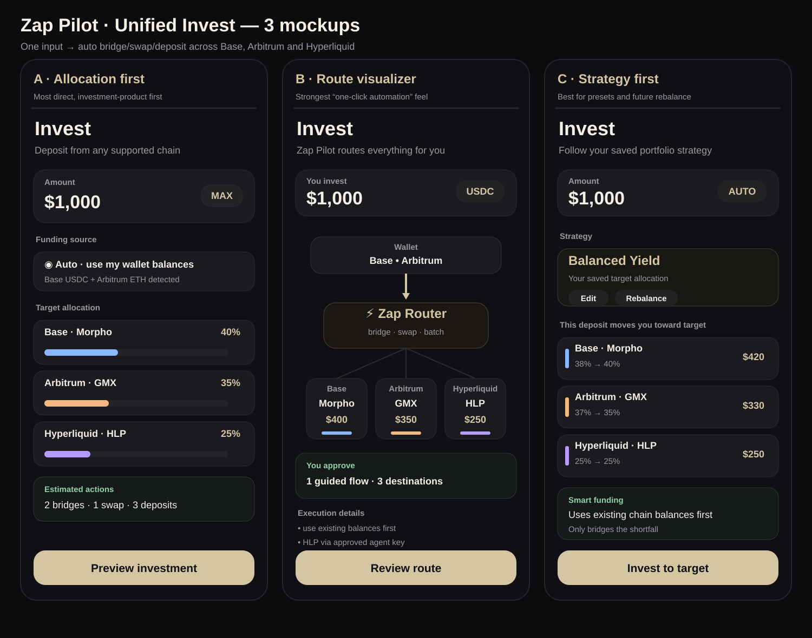

# Unified Invest Experience

## Current product contract

The primary invest flow is portfolio-oriented rather than chain/destination-oriented.

A user can:

1. enter one investment amount;
2. edit the target allocation;
3. fund Morpho and GMX from supported balances on their destination chains while HLP funding is resolved automatically;
4. let Zap Pilot determine the required bridge, swap, and deposit actions;
5. review the resolved execution batches before signing;
6. execute later batches through explicit checkpoints.

`Both`, `Base`, `Arbitrum`, `HLP`, and `Bridge` are not primary invest tabs. The standalone Bridge surface is retained only as a development/testing route, while direct deposits from an existing Hyperliquid USDC balance retain their dedicated HLP entry point.



## Replaced entry model

The earlier invest surface exposed implementation details as five top-level choices (`Both`, `Base`, `Arbitrum`, `HLP`, and `Bridge`) and modeled the draft primarily around chain scope plus destination. That model was replaced by target allocation plus destination-specific funding.

The primary user concepts are now:

- **Funding** — which supported wallet balance funds each position.
- **Target allocation** — where the user wants the new investment allocated.
- **Execution plan** — bridge/swap/deposit actions derived from the chosen funding and target allocation.

The default target is:

```ts
[
  { positionId: 'morpho-base', weightBps: 4000 },
  { positionId: 'gmx-arbitrum', weightBps: 3500 },
  { positionId: 'hlp', weightBps: 2500 },
];
```

A `0%` allocation disables that destination. The minimum total investment is derived from the funded destinations' own minimums rather than from a separate product-wide constant.

## Funding behavior

Morpho and GMX draw on their own destination chain, so their funding token remains a user choice on Base and Arbitrum respectively.

HLP has no EVM destination chain of its own. The amount screen resolves its source automatically by selecting the first supported wallet balance that can cover the whole HLP share after subtracting amounts already claimed by Morpho or GMX from the same token:

`Arbitrum USDC → Base USDC → Ethereum USDC → Base ETH → Arbitrum ETH → Ethereum ETH`

Splitting one HLP allocation across multiple source balances is not attempted.

The route into HyperCore is chosen server-side in `composeDeposit`:

- native Arbitrum USDC uses Hyperliquid Bridge2 as a plain ERC-20 transfer, 1:1, with no approval or bridge fee;
- Base/Ethereum USDC or native ETH uses LI.FI directly into HyperCore in one reviewed wallet batch.

After HyperCore USDC arrives, the approved Hyperliquid agent performs the HLP `vaultTransfer`. The wallet does not sign that final vault action.

Token amounts are frozen when the user leaves the amount step so later price movement cannot change the amounts represented by the reviewed batches.

## Execution and review

`InvestRouteScreen.tsx` presents the reviewed wallet batches in execution order, one batch per **source chain**. Positions funded from the same chain are planned together in a single `chain-batch` review request and merged server-side into one `DepositPlan`, so the wallet is asked to sign once for all of them:

- Morpho always funds from Base;
- GMX always funds from Arbitrum;
- HLP funds from whichever supported chain covers its share, ending in HyperCore.

With the default funding choices that is two batches, not three: Base (Morpho) and Arbitrum (GMX + HLP).

Only the first batch is submitted from the review screen. Every later batch pauses at a checkpoint, is re-reviewed on its execution chain, and is compared with the fingerprints already shown to the user. When they still match, the next batch continues on its own and the wallet prompt appears without a second confirmation; the checkpoint button exists only to retry after a failure. Changed evidence, a blocked or expired review, and a refused submission all stop the queue for a person. A confirmed batch is not resubmitted.

Ethereum mainnet is part of the reviewed wallet-batch execution rail, alongside Base and Arbitrum.

The checkpoint queue is frontend state. The server does not persist a multi-batch invest session: each batch is an independent `/plan-orchestration/deposit/review` request bound by its own expiry and hashes.

## Bridge utility

The standalone Bridge UI is a development/testing utility under the internal invest bridge route. It is not a primary invest product concept.

## Remaining phases

### Unified planning

The current product composes one orchestration request per source chain. A future planner may:

- accept funding sources plus target allocations as one heterogeneous request;
- resolve destination shortfalls across positions;
- split a chain batch that exceeds a wallet's own `wallet_sendCalls` ceiling. No such ceiling is configured today: `ApprovedWallet.maxCallsPerBatch` is the slot for one, deliberately unset until a real limit is reproduced rather than guessed.

### Target-aware deposits

A later phase may:

- read current portfolio weights;
- direct new capital toward underweight positions;
- expose explicit rebalancing separately from investing;
- support additional chains/protocols without adding new top-level tabs.

## Non-goals of the current implementation

- globally optimal bridge routing across multiple partial source balances;
- arbitrary protocol discovery;
- exact portfolio rebalance through selling existing positions;
- replacing the approved Hyperliquid agent signing model.
